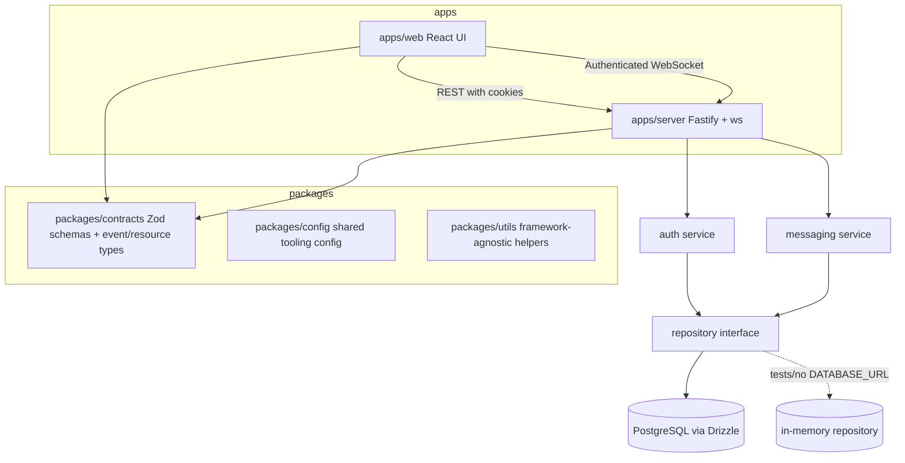

# AGENTS.md

This is the primary onboarding guide for future AI coding agents working on PulseChat. Read this file before scanning the repository. Then read `docs/context-handoff.md`, `docs/project-decisions.md`, and only the task-relevant source files.

## Project Overview

PulseChat is a production-inspired real-time messaging application. It started as a Phase 1 global WebSocket chat and now supports the Phase 2 product slice: authenticated one-to-one conversations, persistent message history, REST state loading, and live WebSocket delivery.

Purpose:

- Teach WebSockets, TypeScript, full-stack architecture, persistence, DevOps, CI/CD, observability, distributed systems, and scalability.
- Provide a clean, maintainable codebase where each layer has a clear responsibility.
- Favor architecture that can evolve over quick feature hacks.

Learning objectives:

- Build real-time messaging with raw `ws`, not Socket.IO.
- Share runtime-validated contracts across client and server.
- Keep transport code thin and move business rules into services.
- Understand how authenticated REST and authenticated WebSockets cooperate.
- Understand how a repository boundary lets tests use in-memory state while production uses PostgreSQL.
- Practice documentation-driven implementation and handoff discipline.

Current phase:

- Phase 2 implemented.
- The app supports registration, login, logout, session persistence, protected routes, one-to-one conversations, persisted messages, message history, optimistic UI, delivery confirmations, typing indicators, read receipts, presence events, and authenticated WebSocket connections.
- Redis, Docker, observability, horizontal scaling, production deployment, group chat, attachments, reactions, and search are intentionally not implemented yet.

High-level architecture:

REST loads existing state. WebSockets deliver live events only.

## Repository Structure

Root files:

- `README.md`: public project overview, setup, architecture summary, status, scripts, and roadmap.
- `AGENTS.md`: required first-read guide for AI agents.
- `package.json`: root scripts, workspace tooling, Drizzle commands.
- `pnpm-workspace.yaml`: workspace package declarations.
- `turbo.json`: task graph for builds, tests, lint, and typecheck.
- `eslint.config.mjs`: workspace lint configuration.
- `.prettierrc.json`: formatting rules.
- `.gitignore`: ignored dependencies, build outputs, env files, logs, and TypeScript build metadata.

Applications:

- `apps/web/`: React/Vite frontend.
- `apps/web/src/App.tsx`: route setup and protected route composition.
- `apps/web/src/routes/`: `/login`, `/register`, `/conversations`, and `/chat/:conversationId`.
- `apps/web/src/components/chat/`: chat input and message-surface components.
- `apps/web/src/components/conversations/`: conversation list, headers, avatars, typing, unread, and delivery-status components.
- `apps/web/src/components/ui/`: local source-owned UI primitives.
- `apps/web/src/lib/`: API client, query client, query keys, URL helpers, storage, WebSocket parser.
- `apps/web/src/state/`: Zustand realtime store and reconnect helpers.
- `apps/web/src/styles/`: Tailwind entrypoint.
- `apps/server/`: Fastify backend.
- `apps/server/drizzle/`: SQL migrations.
- `apps/server/src/auth/`: password hashing, session token hashing, registration/login/logout/session validation.
- `apps/server/src/config/`: environment parsing and defaults.
- `apps/server/src/db/`: Drizzle table schema.
- `apps/server/src/messaging/`: conversation and message business logic.
- `apps/server/src/repositories/`: `AppRepository` interface plus memory and PostgreSQL implementations.
- `apps/server/src/server/`: Fastify app factory and REST route registration.
- `apps/server/src/validation/`: safe JSON parsing helpers for WebSocket payloads.
- `apps/server/src/websocket/`: authenticated gateway, client session shape, logger, event sending helper.
- `apps/server/src/chat/` and `apps/server/src/users/`: legacy Phase 1 global-chat services retained for compatibility tests and reference. Do not route new Phase 2 behavior through them.

Packages:

- `packages/contracts/`: only home for shared REST resource schemas, WebSocket event schemas, inferred types, limits, and protocol constants.
- `packages/config/`: shared TypeScript configuration.
- `packages/utils/`: framework-agnostic helpers such as ID generation and exhaustive checks.

Documentation:

- `docs/architecture.md`: detailed architecture and boundaries.
- `docs/websocket-protocol.md`: event names, payload contracts, validation rules, and flows.
- `docs/coding-guidelines.md`: TypeScript, module, validation, persistence, and error-handling standards.
- `docs/development-workflow.md`: implementation order, feature checklist, testing checklist, and Definition of Done.
- `docs/project-decisions.md`: durable memory for significant architecture decisions.
- `docs/context-handoff.md`: latest implementation handoff summary. Overwrite at the end of every session.
- `docs/future-roadmap.md`: phased roadmap.

## Technology Decisions

React was selected because it is widely used, supports component-driven UI architecture, and works well with Vite and source-owned UI primitives. Alternatives rejected: Next.js for the current phases because server rendering and framework API routes add unnecessary complexity; Svelte/Vue because the learning path standardizes on React.

Vite was selected for fast frontend iteration and simple local builds. Alternatives rejected: Webpack because it requires more configuration; Next.js because full-stack framework features are not needed for the client.

React Router was selected for explicit client-side routes. Alternatives rejected: file-system routing because the project is not using Next.js or Remix.

TanStack Query was selected for authenticated REST server state because it handles caching, loading, error, and invalidation flows cleanly. Alternatives rejected: custom fetch caches because they become brittle as REST resources grow; Redux Toolkit Query because the app already uses Zustand for realtime state and does not need a larger global store.

Zustand was selected for WebSocket lifecycle and realtime UI state because it is small and explicit. Alternatives rejected: Redux Toolkit because it is heavier than needed; React Context alone because connection actions, reconnect state, and event handling become awkward as the client grows.

TailwindCSS was selected for fast, consistent styling with small UI components. Alternatives rejected: CSS Modules for this project because they slow design iteration; heavy component libraries because they reduce control over the learning surface.

Fastify was selected for backend HTTP composition, plugin ergonomics, schema-friendly design, and performance. Alternatives rejected: Express because Fastify gives stronger structure and performance defaults; NestJS because it adds framework complexity before the domain needs it.

`ws` was selected to learn raw WebSocket concepts and maintain protocol control. Socket.IO was intentionally rejected because it adds its own protocol, reconnection semantics, rooms, and fallbacks that would hide core WebSocket learning objectives.

Drizzle ORM was selected because it keeps schema definitions TypeScript-native while preserving SQL visibility through migrations. Alternatives rejected: Prisma because it adds a separate schema DSL and heavier client generation; raw SQL everywhere because it would duplicate mapping and type work.

PostgreSQL was selected for durable relational data: users, sessions, conversations, members, and messages. Alternatives rejected: SQLite because production targets are expected to need a networked relational database; MongoDB because conversations, memberships, sessions, and message indexes fit relational constraints well.

Secure session-based authentication was selected instead of Better Auth for this phase. Better Auth was preferred by the brief, but explicit cookie sessions, Node `scrypt`, and hashed session tokens are smaller, easier to inspect, and better for the current learning goals. Better Auth can be reconsidered when OAuth, email verification, or multi-provider auth becomes necessary.

Zod was selected for runtime validation and type inference. Alternatives rejected: Joi because it does not integrate with TypeScript as directly; io-ts because it is more functional and heavier for this learning path; class-validator because it encourages class-based DTOs.

pnpm workspaces were selected for efficient monorepo dependency management. Alternatives rejected: npm workspaces because pnpm has stronger dependency isolation and workspace ergonomics; Yarn because pnpm is the project standard.

Turborepo was selected for task orchestration and caching across apps/packages. Alternatives rejected: Nx because it is more feature-rich than needed; custom scripts because they become brittle as packages grow.

Vitest was selected because it integrates naturally with Vite and TypeScript. Alternatives rejected: Jest because it often requires more transform configuration in modern ESM/Vite projects.

Vite 5 is used with Vitest 2 to keep the frontend build and test toolchain on one compatible Vite major. Alternatives rejected: mixing Vite 6 with Vitest 2 because it caused duplicate Vite type graphs during config typechecking.

## Coding Standards

- Use strict TypeScript everywhere.
- Do not use `any`. If a value is external or unknown, type it as `unknown` and validate or narrow it.
- Prefer composition over inheritance.
- Keep modules small, focused, and single responsibility.
- Prefer pure functions in services and utilities when practical.
- Keep side effects at boundaries: Fastify route handlers, WebSocket gateway, repository implementations, local storage, process config, and timers.
- Use named exports for shared modules.
- Use PascalCase for React components and TypeScript types.
- Use camelCase for variables, functions, object properties, and service methods.
- Use SCREAMING_SNAKE_CASE only for true constants sourced from environment or protocol limits.
- Use kebab-case for route folders and package names unless a tool requires otherwise.
- Use `*.schema.ts` for Zod schemas, `*.types.ts` for type-only modules, `*.service.ts` for business services, and `*.test.ts` for tests.
- Keep validation schemas near the boundary or in `packages/contracts`.
- Convert Zod REST failures into safe 400 responses and WebSocket failures into protocol `error` events.
- Do not leak stack traces, password hashes, session token hashes, database errors, environment values, or internal module names to clients.
- Use explicit error codes for expected domain and validation failures.
- Use typed result objects for expected service failures.
- Keep imports directional: apps may import packages; packages must not import apps.
- Avoid deep relative imports when package exports are available.
- Do not introduce circular dependencies.

## Architecture Rules

Future agents must not violate these rules:

- Frontend must never access database models, Drizzle tables, repository implementations, or server-only domain internals.
- Shared contracts live only inside `packages/contracts`.
- REST request and response payloads must be Zod validated.
- WebSocket payloads must always be Zod validated before use.
- Business logic never belongs inside WebSocket handlers.
- Business logic never belongs inside REST route handlers.
- WebSocket handlers may authenticate, parse, validate, call services, and send events; they must not own domain rules.
- REST handlers may authenticate, parse, validate, call services/repositories, and shape responses; they must not own domain rules.
- Persistence must go through `AppRepository`.
- Drizzle imports must stay in `apps/server/src/db` and `apps/server/src/repositories/postgres.repository.ts`.
- Password hashes and session token hashes must never be sent to clients.
- Frontend authenticated requests must use cookies through the API client, not manually assembled auth headers.
- REST loads historical state; WebSockets must not fetch historical data.
- `packages/contracts` must not import from `apps/*`.
- `packages/utils` must not import React, Fastify, `ws`, database clients, or app modules.
- Server modules must not import frontend components or browser APIs.
- UI components must not import server services.
- No circular dependencies.
- No duplicated event type definitions between client and server.
- No unvalidated JSON parsing from WebSocket messages.
- No raw user-generated HTML rendering.
- No broad rewrites when localized changes satisfy the task.
- No undocumented significant architecture changes.

## Development Workflow

Recommended implementation order:

1. Read `AGENTS.md`, `docs/context-handoff.md`, and the task-relevant docs.
2. Inspect only files needed for the task.
3. Update shared contracts before implementing REST or WebSocket behavior.
4. Update Drizzle schema and migration if persistent data changes.
5. Implement backend service logic before route or gateway wiring.
6. Keep persistence changes behind `AppRepository`.
7. Implement frontend API/query state before UI that consumes it.
8. Implement frontend WebSocket store behavior before UI that consumes live events.
9. Add tests for contracts, services, repositories when practical, REST routes, gateway behavior, and frontend state helpers.
10. Run lint, typecheck, tests, build, and format checks as relevant.
11. Update documentation.
12. Overwrite `docs/context-handoff.md`.

Feature checklist:

- Shared contract added or updated in `packages/contracts`.
- Runtime validation added at REST and WebSocket boundaries.
- Server business logic lives in a service module.
- Persistent data access goes through `AppRepository`.
- Migration added for schema changes.
- Frontend uses TanStack Query for REST state.
- Frontend uses Zustand for WebSocket/realtime state.
- User-facing errors are safe and clear.
- Tests cover the contract and highest-risk behavior.
- Documentation reflects setup, architecture, protocol, and roadmap changes.

Testing checklist:

- Contract schema tests for valid and invalid payloads.
- Auth service tests for register, login, logout, duplicate usernames, and session validation.
- Messaging service tests for conversation creation, membership, duplicate prevention, and read state.
- REST route tests for authenticated and unauthenticated behavior.
- WebSocket gateway tests for auth, invalid payloads, message delivery, typing, read receipts, and presence.
- Frontend state tests for reconnect, server event parsing, optimistic updates, and errors.
- Component tests for core UI states when practical.
- Typecheck from the repository root.
- Lint from the repository root.
- Format check from the repository root.

Definition of Done:

- Requested behavior is implemented.
- No known TypeScript, lint, format, or test failures remain.
- New or changed REST and WebSocket payloads are validated with Zod.
- Database schema changes include migrations.
- Relevant docs are updated.
- `docs/context-handoff.md` is overwritten with the latest project state.
- Significant decisions are recorded in `docs/project-decisions.md`.
- The repository is ready for another engineer or AI agent to continue without prior chat context.

## Token Saving Strategy

Future agents should:

- Read `AGENTS.md` first.
- Read `docs/context-handoff.md` second.
- Avoid scanning the entire repository.
- Read only files relevant to the requested task.
- Reuse existing abstractions.
- Never rewrite files unnecessarily.
- Keep changes as localized as possible.
- Prefer `rg` and targeted file reads.
- Use documentation indexes to decide which source files matter.
- Summarize findings briefly before implementing large changes.

## Context Handoff Strategy

At the end of every implementation session, overwrite `docs/context-handoff.md` with the latest project state.

The handoff must include:

- Current phase
- Completed work
- Files modified
- Architectural decisions
- Breaking changes
- Known issues
- TODOs
- Recommended next task
- Potential risks
- Questions for future implementation

Use concise bullets. The goal is continuity, not a transcript.

## Project Memory

Maintain `docs/project-decisions.md` as the durable architecture memory.

Every significant architectural decision must include:

- Date
- Decision
- Reason
- Alternatives considered
- Trade-offs
- Impact
- Future implications

Examples of significant decisions:

- Adding a database or Redis.
- Changing event envelopes.
- Moving shared code between packages.
- Introducing authentication.
- Changing deployment targets.
- Replacing `ws`, Fastify, React, Zustand, TanStack Query, Drizzle, PostgreSQL, or Turborepo.
- Changing validation strategy.

## Required Session Closeout

Before finishing any implementation session:

1. Run the relevant verification commands.
2. Update `README.md` if setup, scripts, status, or architecture changed.
3. Update `docs/architecture.md` if boundaries or modules changed.
4. Update `docs/websocket-protocol.md` if events changed.
5. Update `docs/project-decisions.md` for major decisions.
6. Update `docs/future-roadmap.md` if phases evolved.
7. Overwrite `docs/context-handoff.md`.
8. Final response should mention verification performed and any known gaps.
