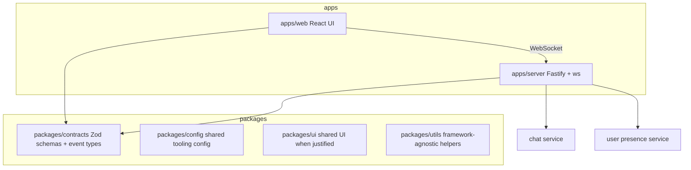

# AGENTS.md

This is the primary onboarding guide for future AI coding agents working on PulseChat. Read this file before scanning the repository. Then read only the task-relevant docs and source files.

## Project Overview

PulseChat is a production-inspired real-time messaging application. The first product slice is a small global chat room, but the architecture should support later evolution into a production-ready messaging platform.

Purpose:

- Teach WebSockets, TypeScript, full-stack architecture, Docker, DevOps, CI/CD, observability, distributed systems, and scalability.
- Provide a clean, maintainable codebase where each layer has a clear responsibility.
- Favor architecture that can evolve over quick feature hacks.

Learning objectives:

- Build real-time messaging with raw `ws`, not Socket.IO.
- Share runtime-validated contracts across client and server.
- Keep WebSocket transport code thin and move business rules into services.
- Understand how in-memory state evolves toward database and Redis-backed infrastructure.
- Practice documentation-driven implementation and handoff discipline.

Current phase:

- Documentation/bootstrap.
- No app code, package manager config, tests, or CI exist yet.
- Phase 1 implementation should scaffold the monorepo and build the in-memory chat.

High-level architecture:

## Repository Structure

Current files:

- `README.md`: public project overview, setup, architecture summary, status, and roadmap.
- `AGENTS.md`: required first-read guide for AI agents.
- `docs/architecture.md`: detailed architecture and boundaries.
- `docs/websocket-protocol.md`: event names, payload contracts, validation rules, and flows.
- `docs/coding-guidelines.md`: TypeScript, module, validation, and error-handling standards.
- `docs/development-workflow.md`: implementation order, feature checklist, testing checklist, and Definition of Done.
- `docs/project-decisions.md`: project memory for significant architecture decisions.
- `docs/context-handoff.md`: latest implementation handoff summary. Overwrite at the end of every session.
- `docs/future-roadmap.md`: phased roadmap.

Target folders:

- `apps/`: runnable applications.
- `apps/web/`: React/Vite frontend. Owns routes, UI composition, browser WebSocket client, and client-side state.
- `apps/server/`: Fastify backend. Owns HTTP server setup, WebSocket upgrade handling, validation boundary, services, and in-memory state for Phase 1.
- `packages/`: shared packages consumed by apps.
- `packages/contracts/`: only home for shared WebSocket contracts, Zod schemas, event types, and validation helpers.
- `packages/config/`: shared TypeScript, ESLint, Prettier, Vitest, and build config.
- `packages/ui/`: shared UI components only when reuse across apps is real. Do not prematurely move app-specific components here.
- `packages/utils/`: framework-agnostic utility functions. No React, Fastify, `ws`, or database imports.
- `.github/`: CI workflows and repository automation.
- `docs/`: durable engineering documentation.

## Technology Decisions

React was selected because it is widely used, supports component-driven UI architecture, and works well with Vite and shadcn/ui. Alternatives rejected: Next.js for Phase 1 because server rendering and routing conventions add unnecessary complexity; Svelte/Vue because the brief standardizes on React learning goals.

Vite was selected for fast frontend iteration and simple local builds. Alternatives rejected: Webpack because it requires more configuration; Next.js because full-stack framework features are not needed for the initial WebSocket client.

TailwindCSS was selected for fast, consistent styling with small UI components. Alternatives rejected: CSS Modules for this project because they slow down design iteration; heavy component libraries because they reduce control over the learning surface.

shadcn/ui was selected for accessible primitives that remain source-owned. Alternatives rejected: Material UI and Ant Design because they bring heavier visual systems and dependency surfaces.

Zustand was selected only for WebSocket client state because it is small and explicit. Alternatives rejected: Redux Toolkit because it is heavier than needed for Phase 1; React Context alone because connection state and actions can become awkward as the client grows.

TanStack Query is reserved for HTTP server state when appropriate. It should not be used for WebSocket event streams. Alternatives rejected: custom fetch caching because TanStack Query will be better once HTTP endpoints exist.

Fastify was selected for backend HTTP composition, plugin ergonomics, schema-friendly design, and performance. Alternatives rejected: Express because Fastify gives better structure and performance defaults; NestJS because it adds framework complexity before the domain needs it.

`ws` was selected to learn raw WebSocket concepts and maintain protocol control. Socket.IO was intentionally rejected because it adds its own protocol, reconnection semantics, rooms, and fallbacks that would hide core WebSocket learning objectives.

Zod was selected for runtime validation and type inference. Alternatives rejected: Joi because it does not integrate with TypeScript as directly; io-ts because it is more functional and heavier for this learning path; class-validator because it encourages class-based DTOs.

pnpm workspaces were selected for efficient monorepo dependency management. Alternatives rejected: npm workspaces because pnpm has stronger dependency isolation and workspace ergonomics; Yarn because pnpm is the project standard.

Turborepo was selected for task orchestration and caching across apps/packages. Alternatives rejected: Nx because it is more feature-rich than needed for the initial monorepo; custom scripts because they become brittle as packages grow.

Vitest was selected because it integrates naturally with Vite and TypeScript. Alternatives rejected: Jest because it often requires more transform configuration in modern ESM/Vite projects.

## Coding Standards

- Use strict TypeScript everywhere.
- Do not use `any`. If a value is external or unknown, type it as `unknown` and validate or narrow it.
- Prefer composition over inheritance.
- Keep modules small, focused, and single responsibility.
- Prefer pure functions in services and utilities when practical.
- Keep side effects at boundaries: WebSocket gateway, HTTP server startup, local storage, process config, and timers.
- Use named exports for shared modules.
- Use PascalCase for React components and TypeScript types.
- Use camelCase for variables, functions, object properties, and service methods.
- Use SCREAMING_SNAKE_CASE only for true constants sourced from environment or protocol limits.
- Use kebab-case for route folders and package names unless a tool requires otherwise.
- Use `*.schema.ts` for Zod schemas, `*.types.ts` for type-only modules, `*.service.ts` for business services, and `*.test.ts` for tests.
- Keep validation schemas near the boundary or in `packages/contracts`.
- Convert Zod failures into protocol `error` events; do not leak raw stack traces to clients.
- Use explicit error codes for expected domain and validation failures.
- Let unexpected server errors be logged server-side and sent as generic protocol errors.
- Keep imports directional: apps may import packages; packages must not import apps.
- Avoid deep relative imports when package exports are available.
- Do not introduce circular dependencies.

## Architecture Rules

Future agents must not violate these rules:

- Frontend must never access database models or server-only domain internals.
- Shared contracts live only inside `packages/contracts`.
- WebSocket payloads must always be Zod validated before use.
- Business logic never belongs inside WebSocket handlers.
- WebSocket handlers may parse, validate, call services, and send events; they must not own domain rules.
- `packages/contracts` must not import from `apps/*`.
- `packages/utils` must not import React, Fastify, `ws`, database clients, or app modules.
- Server modules must not import frontend components or browser APIs.
- UI components must not import server services.
- Phase 1 must not add authentication, database, Redis, Docker, observability, or production deployment unless the roadmap is explicitly changed and documented.
- No circular dependencies.
- No duplicated event type definitions between client and server.
- No unvalidated JSON parsing from WebSocket messages.
- No raw user-generated HTML rendering.
- No broad rewrites when localized changes satisfy the task.
- No undocumented significant architecture changes.

## Development Workflow

Recommended implementation order:

1. Read `AGENTS.md`, `docs/context-handoff.md`, and the task-relevant docs.
2. Inspect only files needed for the task.
3. Update or create shared contracts before implementing client/server event behavior.
4. Implement backend services before gateway wiring.
5. Implement frontend state before UI components that consume it.
6. Add tests for contracts and services.
7. Run lint, typecheck, tests, and relevant build commands.
8. Update documentation.
9. Overwrite `docs/context-handoff.md`.

Feature checklist:

- Shared contract added or updated in `packages/contracts`.
- Runtime validation added at the server boundary.
- Server business logic lives in a service module.
- Frontend state has explicit loading, connected, reconnecting, disconnected, and error states when relevant.
- User-facing errors are safe and clear.
- Tests cover the contract and the highest-risk logic.
- Documentation reflects setup, architecture, and protocol changes.

Testing checklist:

- Contract schema tests for valid and invalid payloads.
- Service unit tests for chat and user presence behavior.
- WebSocket gateway tests for join, send, ping/pong, disconnect, and invalid payloads.
- Frontend state tests for connect, reconnect, send, receive, error, and disconnect.
- Component tests for core UI states when practical.
- Typecheck from the repository root.
- Lint from the repository root.

Definition of Done:

- Requested behavior is implemented.
- No known TypeScript, lint, format, or test failures remain.
- New or changed WebSocket payloads are validated with Zod.
- Relevant docs are updated.
- `docs/context-handoff.md` is overwritten with the latest project state.
- Significant decisions are recorded in `docs/project-decisions.md`.
- The repository is ready for another engineer or AI agent to continue without prior chat context.

## Token Saving Strategy

Future agents should:

- Read `AGENTS.md` first.
- Read `docs/context-handoff.md` second.
- Avoid scanning the entire repository.
- Read only files relevant to the requested task.
- Reuse existing abstractions.
- Never rewrite files unnecessarily.
- Keep changes as localized as possible.
- Prefer `rg` and targeted file reads.
- Use documentation indexes to decide which source files matter.
- Summarize findings briefly before implementing large changes.

## Context Handoff Strategy

At the end of every implementation session, overwrite `docs/context-handoff.md` with the latest project state.

The handoff must include:

- Current phase
- Completed work
- Files modified
- Architectural decisions
- Breaking changes
- Known issues
- TODOs
- Recommended next task
- Potential risks
- Questions for future implementation

Use concise bullets. The goal is continuity, not a transcript.

## Project Memory

Maintain `docs/project-decisions.md` as the durable architecture memory.

Every significant architectural decision must include:

- Date
- Decision
- Reason
- Alternatives considered
- Trade-offs
- Impact
- Future implications

Examples of significant decisions:

- Adding a database or Redis.
- Changing event envelopes.
- Moving shared code between packages.
- Introducing authentication.
- Changing deployment targets.
- Replacing `ws`, Fastify, React, Zustand, or Turborepo.
- Changing validation strategy.

## Required Session Closeout

Before finishing any implementation session:

1. Run the relevant verification commands.
2. Update `README.md` if setup, scripts, status, or architecture changed.
3. Update `docs/architecture.md` if boundaries or modules changed.
4. Update `docs/websocket-protocol.md` if events changed.
5. Update `docs/project-decisions.md` for major decisions.
6. Update `docs/future-roadmap.md` if phases evolved.
7. Overwrite `docs/context-handoff.md`.
8. Final response should mention verification performed and any known gaps.
