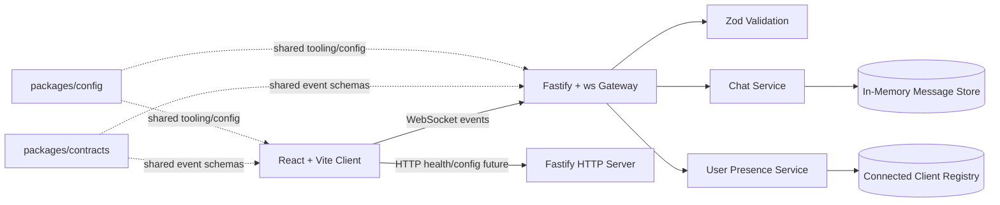
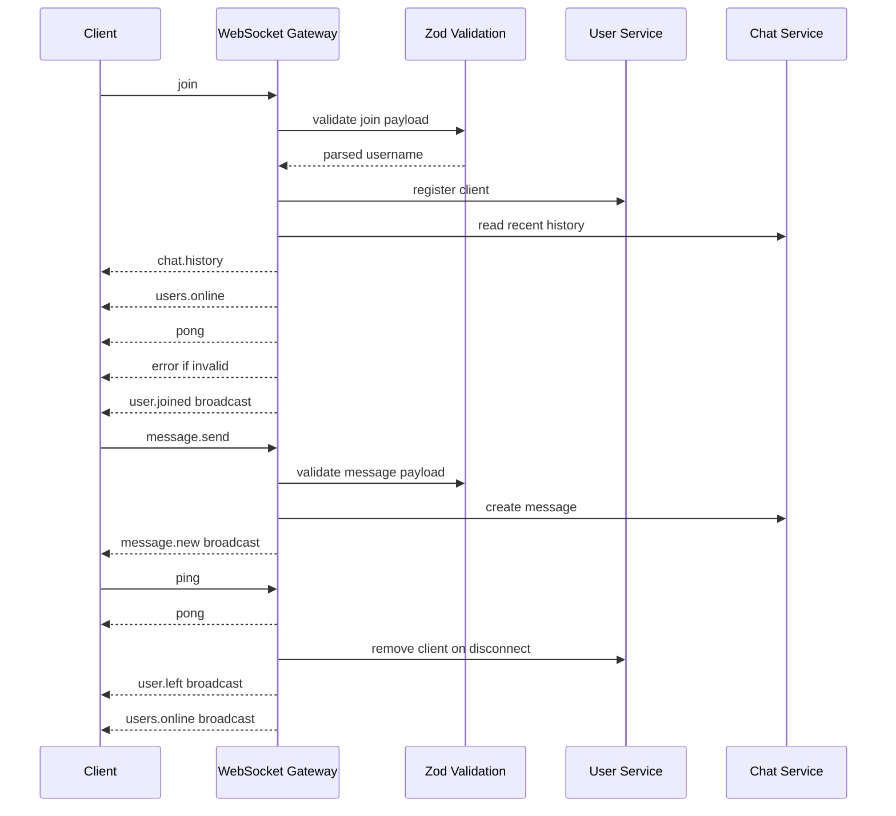

# PulseChat

## Project Overview

PulseChat is a production-inspired real-time messaging application for learning how modern full-stack systems are designed, built, validated, and evolved. The initial product is intentionally small: a single global chat room with usernames, online users, connection status, reconnect behavior, heartbeat checks, and in-memory message history.

The engineering goal is larger than the first feature set. Every choice should keep the project easy to extend toward persistence, authentication, distributed WebSocket infrastructure, observability, CI/CD, and production deployment.

## Learning Objectives

- Build a real-time application with raw WebSockets.
- Practice strict TypeScript across frontend, backend, and shared contracts.
- Design clean full-stack boundaries in a monorepo.
- Validate all network payloads with shared schemas.
- Separate transport, business logic, validation, and UI state.
- Prepare the codebase for Docker, CI/CD, observability, and distributed systems concepts.

## Architecture Diagram



Phase 1 has no database, no Redis, no authentication, no Docker, no observability stack, and no production deployment. Messages and connected users are kept in memory until later phases introduce persistence and horizontal scaling.

## Tech Stack

Frontend:

- React for the interactive chat UI.
- Vite for fast local development and simple frontend builds.
- TypeScript in strict mode for shared type safety.
- TailwindCSS for utility-first styling.
- shadcn/ui for accessible, composable UI primitives.
- Zustand only for WebSocket connection state.
- TanStack Query only when server state over HTTP becomes useful.

Backend:

- Node.js for the runtime.
- Fastify for HTTP server composition, health checks, and future API routes.
- `ws` for raw WebSocket behavior without Socket.IO abstractions.
- Zod for runtime validation of all incoming payloads.
- TypeScript in strict mode.

Monorepo and tooling:

- pnpm workspaces for package management.
- Turborepo for task orchestration.
- ESLint and Prettier for static quality and formatting.
- Husky and lint-staged for pre-commit checks.
- Vitest for unit and integration tests.

Future deployment targets:

- Vercel for the web app.
- Railway for the Node.js server.
- Neon PostgreSQL for persistence.
- Grafana Cloud for metrics, logs, and dashboards.

## Folder Structure

The repository is currently in documentation/bootstrap phase. The target monorepo structure is:

```text
.
|-- apps/
|   |-- web/                 # React/Vite frontend
|   `-- server/              # Fastify/ws backend
|-- packages/
|   |-- contracts/           # Shared Zod schemas and TypeScript event types
|   |-- config/              # Shared TypeScript, ESLint, Prettier, and build config
|   |-- ui/                  # Shared UI components when reuse is justified
|   `-- utils/               # Shared framework-agnostic utilities
|-- docs/
|   |-- architecture.md
|   |-- websocket-protocol.md
|   |-- coding-guidelines.md
|   |-- development-workflow.md
|   |-- project-decisions.md
|   |-- context-handoff.md
|   `-- future-roadmap.md
|-- .github/                 # CI workflows and repository automation
|-- AGENTS.md                # Primary onboarding guide for future AI agents
|-- README.md
|-- package.json
|-- pnpm-workspace.yaml
`-- turbo.json
```

Do not add a separate top-level `shared/` directory unless a future architecture decision explicitly replaces the `packages/*` boundary. Shared contracts belong in `packages/contracts`.

## Getting Started

Current status: the application code has not been scaffolded yet. Documentation is in place so the next implementation session can create the monorepo consistently.

After the workspace is scaffolded, the expected setup flow is:

```bash
pnpm install
pnpm dev
```

Expected local URLs once implemented:

- Web app: `http://localhost:5173`
- Server: `http://localhost:3000`
- WebSocket endpoint: `ws://localhost:3000/ws`

## Development Workflow

Recommended order for Phase 1:

1. Create pnpm workspace, Turborepo config, TypeScript config, ESLint, Prettier, Husky, and lint-staged.
2. Create `packages/contracts` with Zod schemas and discriminated unions for all WebSocket events.
3. Create `apps/server` with Fastify, `ws`, config loading, validation, WebSocket gateway, chat service, and user presence service.
4. Create `apps/web` with React routes for `/` and `/chat`.
5. Add WebSocket client state with Zustand.
6. Build chat UI components.
7. Add tests for contracts, server services, WebSocket validation, and frontend state.
8. Update documentation and `docs/context-handoff.md` before finishing the session.

Documentation is part of the implementation. Update these files whenever behavior, setup, architecture, or roadmap changes.

## Available Scripts

No scripts exist yet because the project has not been scaffolded. The target root scripts are:

```json
{
  "dev": "turbo dev",
  "build": "turbo build",
  "lint": "turbo lint",
  "typecheck": "turbo typecheck",
  "test": "turbo test",
  "format": "prettier --write .",
  "format:check": "prettier --check ."
}
```

Expected package-level scripts:

- `apps/web`: `dev`, `build`, `preview`, `lint`, `typecheck`, `test`.
- `apps/server`: `dev`, `build`, `start`, `lint`, `typecheck`, `test`.
- `packages/contracts`: `build`, `lint`, `typecheck`, `test`.

## Coding Standards

- TypeScript must run in strict mode.
- Do not use `any`; prefer `unknown`, generics, or explicit domain types.
- Validate external input at the boundary with Zod.
- Keep business logic out of WebSocket handlers.
- Prefer composition over inheritance.
- Keep modules small, focused, and single-purpose.
- Avoid duplicated code; extract shared behavior when reuse is real.
- Use named exports for shared modules.
- Keep frontend code out of backend domain internals.
- Keep backend code out of frontend UI packages.
- Avoid circular dependencies.

See [docs/coding-guidelines.md](docs/coding-guidelines.md) for the full standard.

## WebSocket Event Flow



Client to server events:

- `join`
- `message.send`
- `ping`

Server to client events:

- `chat.history`
- `message.new`
- `user.joined`
- `user.left`
- `users.online`
- `pong`
- `error`

All payloads must use shared discriminated unions from `packages/contracts` and must be validated before use.

## Current Project Status

Current phase: documentation/bootstrap.

Completed:

- Product and learning goals captured.
- Target Phase 1 architecture documented.
- WebSocket protocol documented.
- AI agent onboarding and handoff process documented.

Not yet implemented:

- pnpm/Turborepo workspace.
- React frontend.
- Fastify WebSocket server.
- Shared contracts package.
- Tests, linting, formatting, and CI.

## Future Roadmap

Phase 1: In-memory global chat with WebSocket validation, reconnect, heartbeat, online users, and responsive UI.

Phase 2: Local developer hardening with tests, Docker, CI, and better error reporting.

Phase 3: Persistence with PostgreSQL, message history, and basic account identity.

Phase 4: Multi-room chat, authorization boundaries, and richer user presence.

Phase 5: Redis-backed pub/sub, horizontal WebSocket scaling, and observability.

Phase 6: Production deployment, security hardening, and operational runbooks.

See [docs/future-roadmap.md](docs/future-roadmap.md) for more detail.

## Screenshots

Screenshots will be added after the UI exists.

Placeholder:

- Join screen
- Main chat
- Mobile chat
- Connection status states
- Online users panel

## License

License: TBD.

Before public release, add a `LICENSE` file and update this section. MIT is the likely default unless product or dependency constraints require another license.
