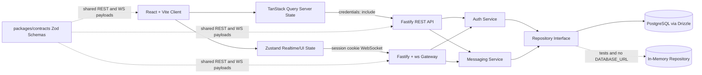
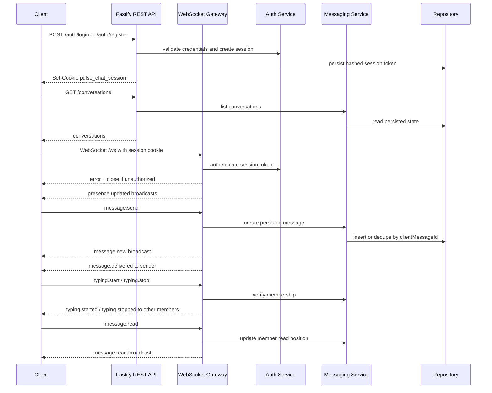

# PulseChat

## Project Overview

PulseChat is a production-inspired real-time messaging application for learning how modern full-stack systems are designed, built, validated, and evolved. The current product slice is a one-to-one messaging app with registration, login, protected routes, conversation creation, message history, optimistic sending, authenticated REST requests, and authenticated WebSocket events.

The engineering goal is larger than the feature set. PulseChat is intentionally structured so later phases can add Redis pub/sub, group conversations, observability, deployment automation, and production hardening without erasing the current boundaries.

## Learning Objectives

- Build real-time messaging with raw WebSockets.
- Practice strict TypeScript across frontend, backend, and shared contracts.
- Design clean full-stack boundaries in a monorepo.
- Validate REST and WebSocket payloads with shared Zod schemas.
- Separate persistence, business logic, transport, and UI state.
- Understand how local in-memory development evolves toward PostgreSQL-backed persistence.
- Keep documentation current as architecture changes.

## Architecture Diagram



REST is responsible for loading existing state. WebSockets are responsible only for realtime message delivery, typing indicators, presence, read receipts, and conversation updates.

## Tech Stack

Frontend:

- React for the interactive messaging UI.
- Vite for fast local development and simple frontend builds.
- React Router for `/login`, `/register`, `/conversations`, and `/chat/:conversationId`.
- TanStack Query for authenticated REST server state.
- Zustand for WebSocket connection state and realtime UI state.
- TailwindCSS and local shadcn-style primitives for source-owned UI.
- Zod for defensive client parsing of server responses and events.

Backend:

- Node.js for the runtime.
- Fastify for HTTP routes, CORS, cookies, health checks, and WebSocket upgrades.
- `ws` for raw WebSocket behavior without Socket.IO abstractions.
- Drizzle ORM with PostgreSQL for persistent users, sessions, conversations, members, and messages.
- A repository interface with an in-memory implementation for tests and local no-database runs.
- Zod for runtime validation at every external boundary.
- Node `scrypt` and hashed secure session tokens for authentication.

Monorepo and tooling:

- pnpm workspaces for package management.
- Turborepo for task orchestration.
- ESLint and Prettier for static quality and formatting.
- Husky and lint-staged for pre-commit checks.
- Vitest for unit and integration tests.

## Folder Structure

```text
.
|-- .husky/                       # Git hooks
|-- apps/
|   |-- server/
|   |   |-- drizzle/              # SQL migrations
|   |   |-- src/auth/             # Registration, login, sessions, password hashing
|   |   |-- src/chat/             # Legacy Phase 1 global chat service tests/support
|   |   |-- src/config/           # Environment parsing and defaults
|   |   |-- src/db/               # Drizzle schema
|   |   |-- src/messaging/        # Conversation and message business logic
|   |   |-- src/repositories/     # Repository interface, Postgres, memory implementations
|   |   |-- src/server/           # Fastify app factory and REST routes
|   |   |-- src/users/            # Legacy Phase 1 presence service tests/support
|   |   |-- src/validation/       # WebSocket JSON parsing helpers
|   |   `-- src/websocket/        # Authenticated WebSocket gateway
|   `-- web/
|       |-- src/components/chat/          # Chat surface components
|       |-- src/components/conversations/ # Conversation list/header/status components
|       |-- src/components/ui/            # Local UI primitives
|       |-- src/lib/                      # API client, query client, URL helpers, parsers
|       |-- src/routes/                   # Auth and messaging routes
|       |-- src/state/                    # Zustand realtime store and reconnect helpers
|       `-- src/styles/                   # Tailwind entrypoint
|-- packages/
|   |-- contracts/                # Shared Zod schemas, REST resources, WS events, constants
|   |-- config/                   # Shared TypeScript config
|   `-- utils/                    # Framework-agnostic helpers
|-- docs/
|   |-- architecture.md
|   |-- websocket-protocol.md
|   |-- coding-guidelines.md
|   |-- development-workflow.md
|   |-- project-decisions.md
|   |-- context-handoff.md
|   `-- future-roadmap.md
|-- AGENTS.md                     # Primary onboarding guide for future AI agents
|-- README.md
|-- package.json
|-- pnpm-lock.yaml
|-- pnpm-workspace.yaml
|-- tsconfig.json
`-- turbo.json
```

Shared contracts belong in `packages/contracts`. Do not add a top-level `shared/` directory unless an architecture decision explicitly replaces the current package boundary.

## Getting Started

Requirements:

- Node.js `>=22`
- pnpm `>=10`
- PostgreSQL for persistent local data

Install dependencies:

```bash
pnpm install
```

Create environment files:

```bash
cp apps/server/.env.example apps/server/.env
cp apps/web/.env.example apps/web/.env
```

For persistent storage, set `DATABASE_URL` in `apps/server/.env`, then apply migrations:

```bash
pnpm db:migrate
```

If `DATABASE_URL` is omitted or blank, the server uses the in-memory repository. That mode is useful for tests and quick local exploration, but data resets on server restart.

Run the full local stack:

```bash
pnpm dev
```

Local URLs:

- Web app: `http://localhost:5173`
- Server: `http://localhost:3000`
- WebSocket endpoint: `ws://localhost:3000/ws`

Important environment variables:

- `DATABASE_URL`: PostgreSQL connection string.
- `SESSION_COOKIE_NAME`: defaults to `pulse_chat_session`.
- `SESSION_TTL_DAYS`: defaults to `30`.
- `SECURE_COOKIES`: use `true` behind HTTPS.
- `ALLOWED_ORIGINS`: comma-separated CORS allow list.
- `VITE_API_URL`: frontend REST base URL.
- `VITE_WS_URL`: frontend WebSocket URL.

## Development Workflow

Recommended workflow for new work:

1. Read `AGENTS.md` and `docs/context-handoff.md`.
2. Update `packages/contracts` first if REST resources or WebSocket events change.
3. Keep backend business logic in `auth` and `messaging` services, not in REST route handlers or WebSocket handlers.
4. Keep persistence behind `AppRepository`.
5. Use REST and TanStack Query for loading existing server state.
6. Use WebSockets and Zustand for live events only.
7. Add or update focused tests near the changed behavior.
8. Run verification from the repository root.
9. Update relevant docs and overwrite `docs/context-handoff.md`.

Documentation is part of the implementation. Update README, architecture, protocol, roadmap, decisions, and handoff files whenever behavior, setup, or architecture changes.

## Available Scripts

Root scripts:

```json
{
  "dev": "pnpm build:packages && turbo dev --parallel",
  "build:packages": "turbo build --filter=@pulse-chat/contracts --filter=@pulse-chat/utils",
  "db:generate": "drizzle-kit generate --config apps/server/drizzle.config.ts",
  "db:migrate": "drizzle-kit migrate --config apps/server/drizzle.config.ts",
  "build": "turbo build",
  "lint": "turbo lint",
  "typecheck": "turbo typecheck",
  "test": "turbo test",
  "format": "prettier --write .",
  "format:check": "prettier --check ."
}
```

Package scripts:

- `apps/web`: `dev`, `build`, `preview`, `lint`, `typecheck`, `test`.
- `apps/server`: `dev`, `build`, `start`, `lint`, `typecheck`, `test`.
- `packages/contracts`: `build`, `lint`, `typecheck`, `test`.
- `packages/utils`: `build`, `lint`, `typecheck`, `test`.

## Coding Standards

- TypeScript must run in strict mode.
- Do not use `any`; prefer `unknown`, generics, or explicit domain types.
- Validate external input at the boundary with Zod.
- Keep business logic out of REST route handlers and WebSocket handlers.
- Prefer composition over inheritance.
- Keep modules small, focused, and single-purpose.
- Use named exports for shared modules.
- Keep frontend code out of backend domain internals.
- Keep backend code out of frontend UI packages.
- Keep database and ORM types behind server repositories.
- Avoid circular dependencies.

See [docs/coding-guidelines.md](docs/coding-guidelines.md) for the full standard.

## WebSocket Event Flow



Client to server WebSocket events:

- `conversation.create`
- `message.send`
- `message.read`
- `typing.start`
- `typing.stop`
- `ping`

Server to client WebSocket events:

- `conversation.created`
- `message.new`
- `message.delivered`
- `message.read`
- `presence.updated`
- `typing.started`
- `typing.stopped`
- `pong`
- `error`

The legacy Phase 1 `join`, `chat.history`, `user.joined`, `user.left`, and `users.online` contracts remain in the shared package for compatibility with existing service tests, but the Phase 2 application flow uses authenticated conversations instead of anonymous global-room joins.

## Current Project Status

Current phase: Phase 2 implemented.

Completed:

- pnpm/Turborepo workspace.
- Shared `packages/contracts` package with REST resource schemas and WebSocket discriminated unions.
- Fastify + `ws` backend with REST auth routes, REST conversation/message routes, authenticated WebSocket gateway, heartbeat cleanup, and safe errors.
- Drizzle PostgreSQL schema and SQL migration for users, sessions, conversations, members, and messages.
- Repository interface with PostgreSQL and in-memory implementations.
- Secure session-based authentication with password hashing and hashed session tokens.
- React/Vite frontend with login, register, conversation list, chat route, protected routes, optimistic messages, TanStack Query, and Zustand realtime state.
- Unit and integration tests for contracts, utilities, services, REST routes, WebSocket behavior, parsers, and frontend state helpers.
- ESLint, Prettier, Husky, lint-staged, Vitest, and strict TypeScript.

Not included yet:

- Redis/pub-sub.
- Docker.
- Observability.
- Horizontal scaling.
- Kubernetes.
- Production deployment optimization.
- Group conversations, attachments, reactions, or search.

## Future Roadmap

Phase 0: Documentation and bootstrap.

Phase 1: In-memory global chat with WebSocket validation, reconnect, heartbeat, online users, and responsive UI.

Phase 2: Persistent one-to-one messaging with authentication, PostgreSQL/Drizzle, REST state loading, authenticated WebSockets, optimistic UI, and duplicate prevention.

Phase 3: Developer hardening with CI, browser smoke tests, stronger component coverage, and optional local Docker support.

Phase 4: Group conversations, richer authorization, profiles, moderation primitives, and history pagination.

Phase 5: Redis-backed pub/sub, horizontal WebSocket scaling, presence synchronization, rate limiting, and load testing.

Phase 6: Observability, production deployment, operational runbooks, and security hardening.

See [docs/future-roadmap.md](docs/future-roadmap.md) for more detail.

## Screenshots

Screenshots will be added after the UI is captured.

Placeholder:

- Login screen
- Register screen
- Conversation list
- Chat screen
- Mobile conversation view
- Connection and reconnect states

## License

License: TBD.

Before public release, add a `LICENSE` file and update this section. MIT is the likely default unless product or dependency constraints require another license.
