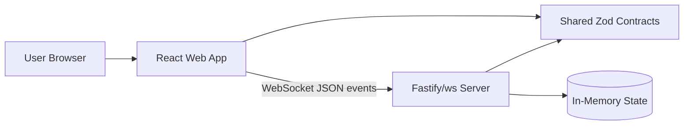
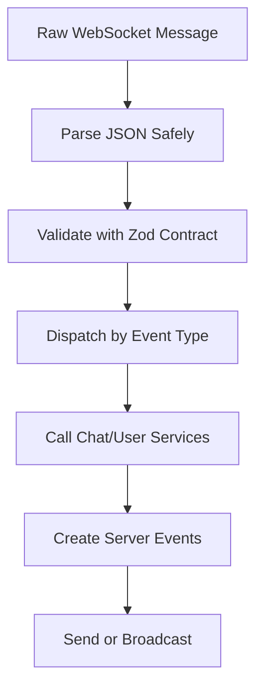

# Architecture

PulseChat is designed as a TypeScript monorepo with separate frontend, backend, and shared package boundaries. The Phase 1 implementation is intentionally small and in-memory, but the architecture should remain compatible with later persistence, authentication, observability, and horizontal scaling.

## Current Phase

Current phase: documentation/bootstrap.

The repository currently contains documentation only. Application code, package manager configuration, tests, and CI have not been scaffolded yet. This document defines the target architecture for Phase 1.

## System Context



Phase 1 state is process-local. Restarting the server clears message history and connected user state.

## Target Monorepo Layout

```text
apps/
  web/
    src/
      app/
      components/
      features/chat/
      routes/
      state/
      styles/
  server/
    src/
      server/
      websocket/
      chat/
      users/
      config/
      validation/
packages/
  contracts/
  config/
  ui/
  utils/
docs/
.github/
```

## Application Responsibilities

### `apps/web`

Owns the browser experience.

Responsibilities:

- Render `/` join screen.
- Render `/chat` main chat experience.
- Connect to the WebSocket endpoint.
- Manage WebSocket connection state with Zustand.
- Display messages, online users, connection state, loading state, and errors.
- Validate assumptions at the UI boundary when useful, but rely on server validation for trust.
- Import event schemas and types from `packages/contracts`.

Non-responsibilities:

- Database access.
- Server-side domain logic.
- Re-defining WebSocket event types.
- Trusting local user input as valid server data.

### `apps/server`

Owns backend process startup, HTTP server setup, WebSocket connections, validation boundary, and in-memory services.

Target modules:

- `server`: Fastify app setup, health route, WebSocket upgrade integration, lifecycle.
- `websocket`: gateway, connection registry integration, event dispatch, send/broadcast helpers, heartbeat.
- `chat`: message creation, history, message limits, chat domain rules.
- `users`: username registration, presence, connected users list, disconnect behavior.
- `config`: environment parsing, port, host, CORS/origin rules, heartbeat intervals.
- `validation`: helpers for safely parsing incoming WebSocket JSON and mapping Zod errors.

Non-responsibilities:

- UI rendering.
- Frontend state management.
- Duplicating shared contracts.
- Long-term persistence in Phase 1.

### `packages/contracts`

Owns the protocol between apps.

Responsibilities:

- Zod schemas for client-to-server events.
- Zod schemas for server-to-client events.
- Inferred TypeScript types.
- Event discriminated unions.
- Protocol constants such as event names and payload limits when shared.

Rules:

- No imports from `apps/*`.
- No server-only or browser-only APIs.
- No business logic beyond validation and protocol shaping.

### `packages/config`

Owns shared tool configuration.

Examples:

- Base TypeScript config.
- ESLint config.
- Prettier config.
- Vitest config helpers if needed.

### `packages/ui`

Owns reusable UI primitives only when reuse is real.

Phase 1 chat-specific components should usually start in `apps/web`. Move components to `packages/ui` only when they become generic and useful across apps.

### `packages/utils`

Owns framework-agnostic helpers.

Allowed:

- Date formatting helpers that do not depend on browser-only APIs.
- ID helper wrappers if they are platform-neutral.
- Exhaustiveness helpers.

Not allowed:

- React imports.
- Fastify imports.
- `ws` imports.
- Database imports.
- App-specific business rules.

## Frontend Architecture

Target routes:

- `/`: join screen for username entry.
- `/chat`: main chat room.

Target components:

- `ChatHeader`
- `ChatMessages`
- `MessageBubble`
- `MessageInput`
- `OnlineUsers`
- `ConnectionBadge`
- `LoadingScreen`
- `ErrorBanner`

State rules:

- Zustand is used only for WebSocket lifecycle and real-time chat state.
- Component-local state is preferred for simple input fields and UI-only toggles.
- TanStack Query should not manage WebSocket streams. Use it later for HTTP server state if needed.

Expected connection states:

- `idle`
- `connecting`
- `connected`
- `reconnecting`
- `disconnected`
- `error`

## Backend Architecture

Target flow:



WebSocket gateway responsibilities:

- Accept and close connections.
- Track connection identifiers.
- Parse incoming JSON safely.
- Validate payloads with contracts.
- Route valid events to services.
- Convert service results into server events.
- Send direct events and broadcasts.
- Run heartbeat checks.
- Remove clients on disconnect.

Service responsibilities:

- `chat` creates messages, stores in-memory history, enforces message limits, and returns domain objects.
- `users` validates username availability rules, tracks online users, and removes users on disconnect.

Business logic must live in services, not gateway handlers.

## Data Model: Phase 1

Expected domain objects:

```ts
type User = {
  id: string;
  username: string;
  joinedAt: string;
};

type ChatMessage = {
  id: string;
  userId: string;
  username: string;
  body: string;
  sentAt: string;
};
```

These types should be represented through contracts or server domain modules as appropriate. Client-visible shapes must be exported from `packages/contracts`.

## Boundary Rules

- Apps may import from packages.
- Packages must not import from apps.
- Contracts are the only shared WebSocket protocol source.
- Frontend must not import server modules.
- Server must not import frontend modules.
- Validation happens before business logic.
- Business logic stays outside transport handlers.
- No circular dependencies.

## Future Architecture Direction

Later phases may add:

- PostgreSQL for users and message persistence.
- Redis pub/sub for multi-instance broadcast.
- Authentication and authorization.
- Room membership and direct messages.
- Docker Compose for local dependencies.
- CI/CD pipelines.
- Metrics, structured logs, traces, and dashboards.

When those changes happen, update this document and record significant decisions in `docs/project-decisions.md`.
