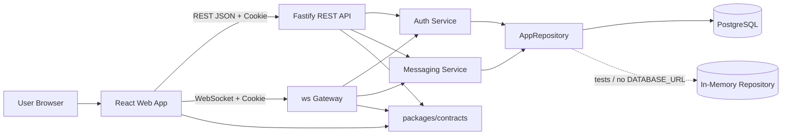
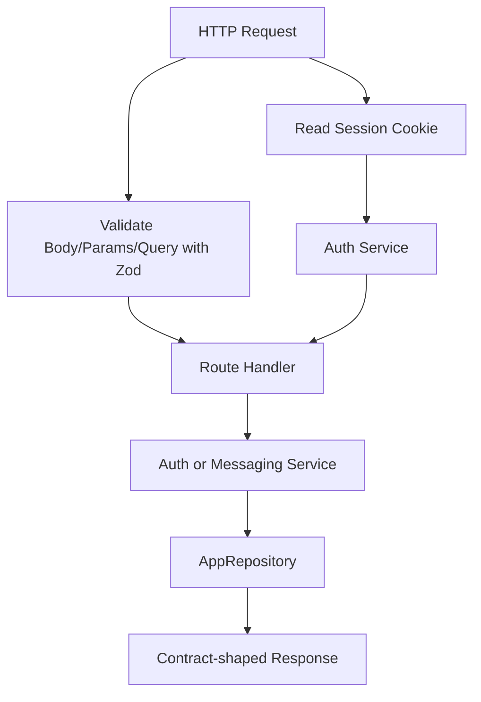
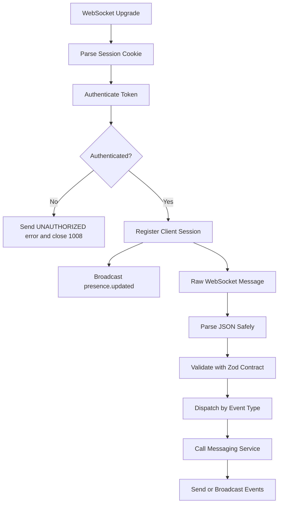

# Architecture

PulseChat is a TypeScript monorepo with separate frontend, backend, and shared package boundaries. The current implementation is Phase 2: authenticated one-to-one messaging with persistent storage, REST APIs for existing state, and WebSockets for realtime updates.

## Current Phase

Current phase: Phase 2 implemented.

The repository contains:

- React/Vite frontend with protected auth and messaging routes.
- Fastify REST API with cookie sessions.
- Authenticated `ws` WebSocket gateway.
- Shared Zod contracts for REST resources and WebSocket events.
- Drizzle/PostgreSQL schema and migration.
- Repository interface with PostgreSQL and in-memory implementations.

Redis, Docker, observability, horizontal scaling, production deployment, group chat, attachments, reactions, and search remain out of scope.

## System Context



REST owns historical state and request/response workflows. WebSockets own only live events.

## Monorepo Layout

```text
apps/
  web/
    src/
      components/
        chat/
        conversations/
        ui/
      lib/
      routes/
      state/
      styles/
      test/
  server/
    drizzle/
    src/
      auth/
      chat/
      config/
      db/
      messaging/
      repositories/
      server/
      users/
      validation/
      websocket/
packages/
  contracts/
  config/
  utils/
docs/
.husky/
```

## Application Responsibilities

### `apps/web`

Owns the browser experience.

Responsibilities:

- Render `/login`, `/register`, `/conversations`, and `/chat/:conversationId`.
- Use the API client for authenticated REST calls with `credentials: include`.
- Use TanStack Query for server state: current user, users, conversations, and messages.
- Use Zustand for WebSocket connection state, realtime event handling, typing state, presence state, optimistic message updates, and current conversation selection.
- Parse server responses and WebSocket events with shared contracts.
- Render loading, empty, error, connected, reconnecting, disconnected, and optimistic-send states.
- Keep UI primitives local until genuine shared reuse appears.

Non-responsibilities:

- Database access.
- Drizzle table imports.
- Server-side domain logic.
- Re-defining REST or WebSocket contracts.
- Trusting browser state, URL params, local storage, or WebSocket payloads as authoritative.

### `apps/server`

Owns backend process startup, HTTP routes, WebSocket upgrades, authentication, messaging business logic, and persistence boundaries.

Implemented modules:

- `server`: Fastify app setup, CORS, cookie plugin, health route, REST routes, WebSocket upgrade integration, lifecycle.
- `auth`: registration, login, logout, session creation, session validation, password hashing with Node `scrypt`, and hashed session tokens.
- `messaging`: one-to-one conversation creation, message creation, membership checks, duplicate prevention, read state, and conversation/message listing.
- `repositories`: `AppRepository` interface, in-memory implementation, and PostgreSQL implementation.
- `db`: Drizzle table schema.
- `websocket`: authenticated gateway, connection registry, event dispatch, send/broadcast helpers, presence, typing, read receipts, heartbeat.
- `validation`: helpers for safely parsing incoming WebSocket JSON and mapping invalid payloads.
- `config`: environment parsing and defaults.
- `chat` and `users`: legacy Phase 1 global-chat services retained for tests/reference. New Phase 2 behavior must not be routed through them.

Non-responsibilities:

- UI rendering.
- Frontend state management.
- Duplicating shared contracts.
- Loading historical data through WebSocket events.

### `packages/contracts`

Owns the client/server protocol.

Responsibilities:

- Zod schemas for REST request and response resources.
- Zod schemas for client-to-server WebSocket events.
- Zod schemas for server-to-client WebSocket events.
- Inferred TypeScript types.
- Event discriminated unions.
- Protocol constants such as event names, payload limits, and error code values.

Rules:

- No imports from `apps/*`.
- No server-only or browser-only APIs.
- No business logic beyond validation and protocol shaping.

### `packages/config`

Owns shared TypeScript configuration.

### `packages/utils`

Owns framework-agnostic helpers.

Allowed:

- ID helper wrappers.
- Exhaustiveness helpers.
- Pure utility functions with no app dependencies.

Not allowed:

- React imports.
- Fastify imports.
- `ws` imports.
- Database imports.
- App-specific business rules.

## Frontend Architecture

Routes:

- `/login`: login with username and password.
- `/register`: create account with username, display name, and password.
- `/conversations`: authenticated conversation list and user search/start flow.
- `/chat/:conversationId`: authenticated conversation view.

Core state:

- TanStack Query caches REST state through `queryKeys`.
- Zustand realtime store owns WebSocket connection status, typing users, presence, current conversation, and outbound realtime events.
- Component-local state is preferred for simple input fields and UI-only toggles.

Important frontend modules:

- `lib/api-client.ts`: typed REST client with Zod response parsing.
- `lib/query-client.ts`: shared TanStack Query client.
- `lib/query-keys.ts`: query key factory.
- `lib/api-url.ts`: REST base URL resolution from `VITE_API_URL`.
- `lib/websocket-url.ts`: WebSocket URL resolution from `VITE_WS_URL`.
- `lib/server-event-parser.ts`: server event parser.
- `state/chat-store.ts`: WebSocket lifecycle and realtime event reducer.
- `state/reconnect.ts`: reconnect delay calculation.

State ownership rule:

- REST data belongs in TanStack Query.
- WebSocket lifecycle and transient realtime UI belongs in Zustand.
- Form fields and open/closed UI toggles belong in local component state.

## Backend Architecture

### REST Flow



REST route responsibilities:

- Read and set cookies.
- Authenticate when required.
- Validate request bodies, params, and query values.
- Call services or repository read helpers.
- Send safe status codes and contract-shaped responses.

REST routes must not own business rules.

### WebSocket Flow



WebSocket gateway responsibilities:

- Authenticate each connection with the secure session cookie.
- Track connected sessions by generated client ID and public user.
- Parse incoming JSON safely.
- Validate payloads with contracts.
- Return `UNKNOWN_EVENT` for unknown discriminants and `VALIDATION_ERROR` for malformed known events.
- Route valid events to messaging services.
- Broadcast conversation, message, typing, read receipt, and presence events.
- Run heartbeat checks.
- Remove clients on disconnect.

Business logic must live in services, not gateway handlers.

## Data Model

Database tables:

- `users`: account identity, username, display name, optional avatar URL, timestamps.
- `sessions`: hashed session token, user reference, expiration, revocation timestamp.
- `conversations`: conversation metadata, currently `one_to_one`, timestamps, soft delete.
- `conversation_members`: conversation membership and per-member `last_read_message_id`.
- `messages`: persisted messages, sender, conversation, optional client message ID, timestamps, soft delete.

Important constraints and indexes:

- Usernames are unique case-insensitively.
- Session token hashes are unique.
- Conversation members are unique per conversation/user pair.
- Messages prevent duplicate sender/client-message pairs.
- Conversations and messages are indexed for list and history queries.

Client-visible domain shapes:

- `PublicUser`
- `Conversation`
- `PersistentMessage`
- REST response schemas
- WebSocket event schemas

These shapes are exported from `packages/contracts`.

## Persistence Strategy

All persistence goes through `AppRepository`.

Implementations:

- `postgres.repository.ts`: Drizzle/PostgreSQL implementation used when `DATABASE_URL` is set.
- `memory.repository.ts`: in-memory implementation used for tests and no-database local runs.

Rules:

- Services depend on the repository interface, not Drizzle.
- REST and WebSocket layers do not import Drizzle.
- Frontend never imports repository or database types.
- Database schema changes require Drizzle schema updates and a migration.

## Auth Strategy

PulseChat uses secure session-based authentication:

- Passwords are hashed with Node `scrypt`.
- Session tokens are random and sent to the browser only as cookies.
- Only session token hashes are stored server-side.
- Logout revokes the current session.
- REST requests use the same cookie as WebSocket authentication.
- WebSocket connections without a valid session receive an `UNAUTHORIZED` error and close with code `1008`.

Sensitive values must never be returned to clients.

## Boundary Rules

- Apps may import from packages.
- Packages must not import from apps.
- Contracts are the only shared protocol source.
- Frontend must not import server modules.
- Server must not import frontend modules.
- Validation happens before business logic.
- Business logic stays outside transport handlers.
- Persistence stays behind `AppRepository`.
- No circular dependencies.

## Future Architecture Direction

Later phases may add:

- CI and browser smoke tests.
- Docker Compose for local PostgreSQL.
- Group conversations and richer authorization.
- History pagination and search.
- Redis pub/sub for multi-instance broadcast.
- Presence synchronization.
- Observability and production runbooks.
- Deployment to Vercel/Railway/Neon or equivalent services.

When those changes happen, update this document and record significant decisions in `docs/project-decisions.md`.
