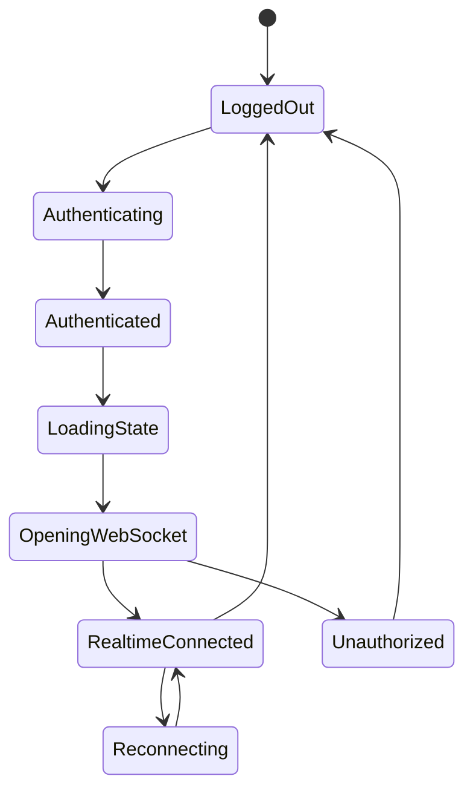

# WebSocket Protocol

This document defines the Phase 2 WebSocket contract for PulseChat. Client and server event definitions live in `packages/contracts`, and every incoming client payload must be validated with Zod before business logic runs.

## Transport

Local endpoint:

```text
ws://localhost:3000/ws
```

Authentication:

- The browser authenticates the WebSocket connection with the same `pulse_chat_session` cookie used by REST.
- Missing, expired, revoked, or invalid sessions receive an `error` event with code `UNAUTHORIZED`.
- Unauthorized sockets close with code `1008`.

Message format:

```json
{
  "type": "event.name",
  "payload": {}
}
```

The `type` field is the discriminant. Event names are stable protocol identifiers and must not change without updating contracts, tests, docs, and project decisions.

## REST Boundary

Do not use WebSockets to fetch historical data.

REST owns:

- `POST /auth/register`
- `POST /auth/login`
- `POST /auth/logout`
- `GET /me`
- `GET /users`
- `GET /conversations`
- `POST /conversations`
- `GET /conversations/:id/messages`
- `POST /messages`

WebSockets own:

- Realtime message delivery.
- Typing indicators.
- Presence changes.
- Read receipt broadcasts.
- Conversation updates.
- Ping/pong heartbeat.

## General Rules

- All messages are JSON objects.
- Binary WebSocket messages are not supported.
- Unknown event types receive an `error` event.
- Invalid payloads receive an `error` event.
- Server must never trust client input.
- Server validates with Zod before calling business services.
- Client should handle every documented server event.
- Server timestamps use ISO 8601 strings.
- IDs are server-generated except `clientMessageId`, which is client-generated for optimistic UI and duplicate prevention.
- WebSocket events must not expose password hashes, session token hashes, database errors, or stack traces.

## Client -> Server Events

### `conversation.create`

Creates or returns a one-to-one conversation with another user.

```json
{
  "type": "conversation.create",
  "payload": {
    "participantUsername": "Grace"
  }
}
```

Validation:

- Authenticated WebSocket connection required.
- `participantUsername` must satisfy the shared username schema.
- User must exist.
- User cannot create a conversation with themselves.

Expected server response:

- Broadcast `conversation.created` to online members.
- Direct `error` for invalid or unauthorized requests.

### `message.send`

Persists and broadcasts a message in an existing conversation.

```json
{
  "type": "message.send",
  "payload": {
    "conversationId": "conv_123",
    "body": "Hello PulseChat",
    "clientMessageId": "client_abc123"
  }
}
```

Validation:

- Authenticated WebSocket connection required.
- Sender must be a conversation member.
- `body` is required and trimmed length must be 1 to 1000 characters.
- `clientMessageId` is required and used to dedupe retries from the same sender.

Expected server response:

- Broadcast `message.new` to online conversation members.
- Direct `message.delivered` to the sender.
- Direct `error` if conversation is missing, sender is not a member, payload is invalid, or message is too long.

### `message.read`

Marks a message as read for the current user and broadcasts the read receipt.

```json
{
  "type": "message.read",
  "payload": {
    "conversationId": "conv_123",
    "messageId": "msg_123"
  }
}
```

Validation:

- Authenticated WebSocket connection required.
- Reader must be a conversation member.
- Message must belong to the conversation.

Expected server response:

- Broadcast `message.read` to online conversation members.
- Direct `error` if validation or membership fails.

### `typing.start`

Broadcasts that the authenticated user started typing in a conversation.

```json
{
  "type": "typing.start",
  "payload": {
    "conversationId": "conv_123"
  }
}
```

Expected server response:

- Broadcast `typing.started` to other online conversation members.

### `typing.stop`

Broadcasts that the authenticated user stopped typing.

```json
{
  "type": "typing.stop",
  "payload": {
    "conversationId": "conv_123"
  }
}
```

Expected server response:

- Broadcast `typing.stopped` to other online conversation members.

### `ping`

Client heartbeat event.

```json
{
  "type": "ping",
  "payload": {
    "sentAt": "2026-07-17T12:00:00.000Z"
  }
}
```

Validation:

- `sentAt` is optional.
- If present, it must be an ISO date string.

Expected server response:

- Direct `pong`.

## Server -> Client Events

### `conversation.created`

Broadcast when a conversation is created or found for online members.

```json
{
  "type": "conversation.created",
  "payload": {
    "conversation": {
      "id": "conv_123",
      "type": "one_to_one",
      "members": [],
      "lastMessage": null,
      "unreadCount": 0,
      "createdAt": "2026-07-17T12:00:00.000Z",
      "updatedAt": "2026-07-17T12:00:00.000Z",
      "deletedAt": null
    }
  }
}
```

The actual `members` array contains `PublicUser` objects.

### `message.new`

Broadcast when a message is persisted.

```json
{
  "type": "message.new",
  "payload": {
    "message": {
      "id": "msg_123",
      "conversationId": "conv_123",
      "sender": {
        "id": "user_123",
        "username": "Ada",
        "displayName": "Ada Lovelace",
        "avatarUrl": null,
        "createdAt": "2026-07-17T12:00:00.000Z",
        "updatedAt": "2026-07-17T12:00:00.000Z"
      },
      "body": "Hello PulseChat",
      "clientMessageId": "client_abc123",
      "createdAt": "2026-07-17T12:01:00.000Z",
      "updatedAt": "2026-07-17T12:01:00.000Z",
      "deletedAt": null
    }
  }
}
```

### `message.delivered`

Sent to the message sender after persistence/broadcast work succeeds.

```json
{
  "type": "message.delivered",
  "payload": {
    "conversationId": "conv_123",
    "clientMessageId": "client_abc123",
    "message": {
      "id": "msg_123",
      "conversationId": "conv_123",
      "sender": {
        "id": "user_123",
        "username": "Ada",
        "displayName": "Ada Lovelace",
        "avatarUrl": null,
        "createdAt": "2026-07-17T12:00:00.000Z",
        "updatedAt": "2026-07-17T12:00:00.000Z"
      },
      "body": "Hello PulseChat",
      "clientMessageId": "client_abc123",
      "createdAt": "2026-07-17T12:01:00.000Z",
      "updatedAt": "2026-07-17T12:01:00.000Z",
      "deletedAt": null
    }
  }
}
```

Clients use `clientMessageId` to reconcile optimistic messages with persisted messages.

### `message.read`

Broadcast when a member updates read state.

```json
{
  "type": "message.read",
  "payload": {
    "conversationId": "conv_123",
    "messageId": "msg_123",
    "readerId": "user_456",
    "readAt": "2026-07-17T12:02:00.000Z"
  }
}
```

### `typing.started`

Broadcast to other online conversation members.

```json
{
  "type": "typing.started",
  "payload": {
    "conversationId": "conv_123",
    "user": {
      "id": "user_123",
      "username": "Ada",
      "displayName": "Ada Lovelace",
      "avatarUrl": null,
      "createdAt": "2026-07-17T12:00:00.000Z",
      "updatedAt": "2026-07-17T12:00:00.000Z"
    }
  }
}
```

### `typing.stopped`

Broadcast to other online conversation members.

```json
{
  "type": "typing.stopped",
  "payload": {
    "conversationId": "conv_123",
    "user": {
      "id": "user_123",
      "username": "Ada",
      "displayName": "Ada Lovelace",
      "avatarUrl": null,
      "createdAt": "2026-07-17T12:00:00.000Z",
      "updatedAt": "2026-07-17T12:00:00.000Z"
    }
  }
}
```

### `presence.updated`

Broadcast when an authenticated user comes online or goes offline.

```json
{
  "type": "presence.updated",
  "payload": {
    "userId": "user_123",
    "status": "online",
    "lastSeenAt": "2026-07-17T12:00:00.000Z"
  }
}
```

`status` is either `online` or `offline`.

### `pong`

Response to client `ping`.

```json
{
  "type": "pong",
  "payload": {
    "sentAt": "2026-07-17T12:00:01.000Z"
  }
}
```

### `error`

Safe error response for validation, protocol, auth, or domain failures.

```json
{
  "type": "error",
  "payload": {
    "code": "VALIDATION_ERROR",
    "message": "Invalid payload.",
    "requestType": "message.send"
  }
}
```

Current error codes:

- `INVALID_JSON`
- `UNKNOWN_EVENT`
- `VALIDATION_ERROR`
- `USERNAME_REQUIRED`
- `USERNAME_TAKEN`
- `USER_NOT_FOUND`
- `SELF_CONVERSATION`
- `INVALID_CREDENTIALS`
- `JOIN_REQUIRED`
- `UNAUTHORIZED`
- `CONVERSATION_NOT_FOUND`
- `DUPLICATE_CONVERSATION`
- `MESSAGE_TOO_LONG`
- `RATE_LIMITED`
- `INTERNAL_ERROR`

Do not send stack traces to clients.

## Legacy Phase 1 Events

The shared contract package still exports these Phase 1 events for compatibility with existing service tests and historical reference:

- Client: `join`
- Server: `chat.history`, `user.joined`, `user.left`, `users.online`

The Phase 2 application flow does not use anonymous global-room joins. New features should use authenticated REST resources and authenticated conversation WebSocket events.

## Connection Lifecycle



Expected client behavior:

- User registers or logs in through REST.
- Server sets the session cookie.
- Client loads `/me`, conversations, and message history through REST.
- Client opens `/ws` with the session cookie.
- Client sends realtime events only after the socket is connected.
- Client reconnects automatically after unexpected disconnects.
- On reconnect, client refetches REST state through TanStack Query as needed and resumes live events.

## Heartbeat

Phase 2 heartbeat supports:

- Client-initiated `ping` and server `pong`.
- Server-side stale connection cleanup through `ws` ping/pong.
- Client connection status updates when the socket closes and reconnect begins.

Defaults:

- Client ping interval: 25 seconds.
- Server heartbeat check interval: 25 seconds.
- Reconnect backoff: starts at 1 second after the first unexpected close and caps at 10 seconds.

## Contract Package Expectations

`packages/contracts` exports:

- REST resource schemas and inferred types.
- Client-to-server event schemas.
- Server-to-client event schemas.
- Event-specific schemas and types where useful.
- Protocol constants for event names, limits, defaults, and error codes.

Example shape:

```ts
export const clientToServerEventSchema = z.discriminatedUnion("type", [
  conversationCreateEventSchema,
  messageSendEventSchema,
  messageReadEventSchema,
  pingEventSchema,
  typingStartEventSchema,
  typingStopEventSchema,
]);
```

Keep this package framework-agnostic.

## Versioning

Phase 2 does not include protocol version negotiation. If multiple deployed clients need compatibility, add a version field or endpoint-level versioning and record that decision in `docs/project-decisions.md`.
