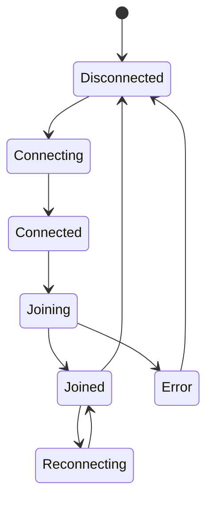

# WebSocket Protocol

This document defines the target Phase 1 WebSocket contract for PulseChat. The implementation must keep client and server event definitions in `packages/contracts` and validate every incoming client payload with Zod.

## Transport

Endpoint:

```text
ws://localhost:3000/ws
```

Production endpoint is not defined yet.

Message format:

```json
{
  "type": "event.name",
  "payload": {}
}
```

The `type` field is the discriminant. Event names are stable protocol identifiers and should not be changed without updating this document, contracts, tests, and project decisions.

## General Rules

- All messages are JSON objects.
- Binary WebSocket messages are not supported in Phase 1.
- Unknown event types receive an `error` event.
- Invalid payloads receive an `error` event.
- Server must never trust client input.
- Server must validate with Zod before calling business services.
- Client should handle every documented server event.
- Server timestamps use ISO 8601 strings.
- IDs are server-generated.

## Client -> Server Events

### `join`

Registers a username for the current connection.

```json
{
  "type": "join",
  "payload": {
    "username": "Ada"
  }
}
```

Validation:

- `username` is required.
- Trimmed length: 2 to 32 characters.
- Allowed characters: letters, numbers, spaces, underscores, and hyphens.
- Server should reject duplicate active usernames in Phase 1 unless a future decision changes this.

Expected server response:

- Direct `chat.history`.
- Direct `users.online`.
- Broadcast `user.joined`.
- `error` if invalid or unavailable.

### `message.send`

Sends a chat message to the global room.

```json
{
  "type": "message.send",
  "payload": {
    "body": "Hello PulseChat"
  }
}
```

Validation:

- Client must have joined successfully.
- `body` is required.
- Trimmed length: 1 to 1000 characters.
- Server stores and broadcasts the trimmed body.

Expected server response:

- Broadcast `message.new`.
- Direct `error` if invalid or sent before joining.

### `ping`

Client heartbeat event.

```json
{
  "type": "ping",
  "payload": {
    "sentAt": "2026-07-17T12:00:00.000Z"
  }
}
```

Validation:

- `sentAt` is optional for Phase 1 but recommended.
- If present, it must be an ISO date string.

Expected server response:

- Direct `pong`.

## Server -> Client Events

### `chat.history`

Sent to a joined client after successful registration.

```json
{
  "type": "chat.history",
  "payload": {
    "messages": [
      {
        "id": "msg_123",
        "userId": "user_123",
        "username": "Ada",
        "body": "Hello PulseChat",
        "sentAt": "2026-07-17T12:00:00.000Z"
      }
    ]
  }
}
```

Rules:

- Phase 1 history is in-memory only.
- Server may cap history length to keep memory bounded.

### `message.new`

Broadcast when a joined user sends a valid message.

```json
{
  "type": "message.new",
  "payload": {
    "message": {
      "id": "msg_124",
      "userId": "user_123",
      "username": "Ada",
      "body": "Hello again",
      "sentAt": "2026-07-17T12:01:00.000Z"
    }
  }
}
```

### `user.joined`

Broadcast when a user joins.

```json
{
  "type": "user.joined",
  "payload": {
    "user": {
      "id": "user_123",
      "username": "Ada",
      "joinedAt": "2026-07-17T12:00:00.000Z"
    }
  }
}
```

### `user.left`

Broadcast when a joined user disconnects.

```json
{
  "type": "user.left",
  "payload": {
    "userId": "user_123",
    "username": "Ada",
    "leftAt": "2026-07-17T12:30:00.000Z"
  }
}
```

### `users.online`

Sent after join and whenever the online user list changes.

```json
{
  "type": "users.online",
  "payload": {
    "users": [
      {
        "id": "user_123",
        "username": "Ada",
        "joinedAt": "2026-07-17T12:00:00.000Z"
      }
    ]
  }
}
```

### `pong`

Response to client `ping` or server heartbeat confirmation.

```json
{
  "type": "pong",
  "payload": {
    "sentAt": "2026-07-17T12:00:01.000Z"
  }
}
```

### `error`

Safe error response for validation, protocol, or domain failures.

```json
{
  "type": "error",
  "payload": {
    "code": "VALIDATION_ERROR",
    "message": "Invalid payload.",
    "requestType": "message.send"
  }
}
```

Recommended error codes:

- `INVALID_JSON`
- `UNKNOWN_EVENT`
- `VALIDATION_ERROR`
- `USERNAME_REQUIRED`
- `USERNAME_TAKEN`
- `JOIN_REQUIRED`
- `MESSAGE_TOO_LONG`
- `RATE_LIMITED`
- `INTERNAL_ERROR`

Do not send stack traces to clients.

## Connection Lifecycle



Expected client behavior:

- User enters a username on `/`.
- Client connects to `/ws`.
- Client sends `join`.
- Client navigates to `/chat` after successful join or keeps `/chat` guarded until joined.
- Client reconnects automatically after unexpected disconnect.
- Client re-sends `join` on reconnect using the last chosen username.

## Heartbeat

Phase 1 heartbeat should support:

- Client-initiated `ping` and server `pong`.
- Server-side stale connection cleanup.
- Client connection status updates when pong is missing.

Suggested defaults:

- Client ping interval: 25 seconds.
- Server stale timeout: 60 seconds.
- Reconnect backoff: start near 500 ms and cap near 10 seconds.

Document and test final values once implemented.

## Contract Package Expectations

`packages/contracts` should export:

- `ClientToServerEventSchema`
- `ServerToClientEventSchema`
- `ClientToServerEvent`
- `ServerToClientEvent`
- Event-specific schemas and types where useful.
- Protocol constants for limits such as username and message length.

Example shape:

```ts
export const clientToServerEventSchema = z.discriminatedUnion("type", [
  joinEventSchema,
  messageSendEventSchema,
  pingEventSchema,
]);

export type ClientToServerEvent = z.infer<typeof clientToServerEventSchema>;
```

Keep this package framework-agnostic.

## Versioning

Phase 1 does not include protocol version negotiation. If the protocol becomes public or multiple deployed clients need compatibility, add a version field or endpoint-level versioning and record that decision in `docs/project-decisions.md`.
